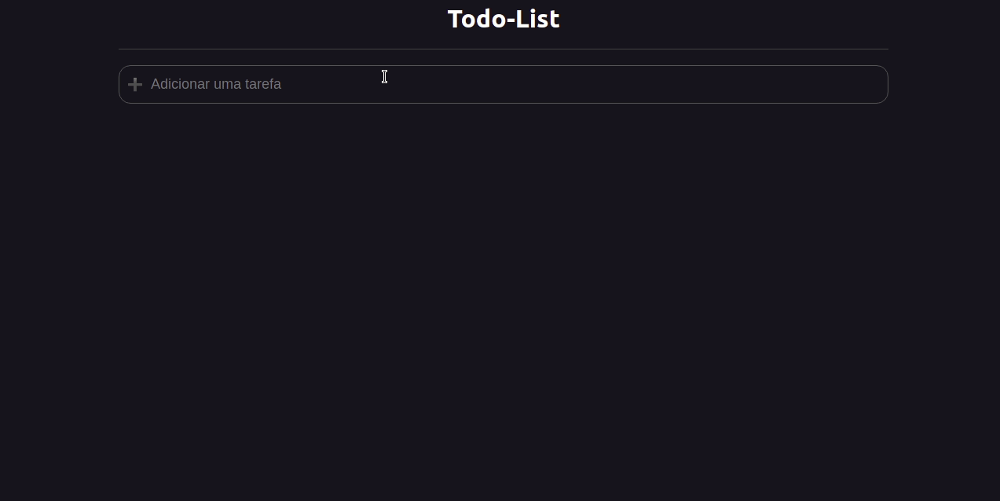

<h1 align="center">
Repositório com exercícios e projetos do meu aprendizado cursando os cursos da B7WEB fullstack.
</h1>

<h2 align="center">HTML e CSS</h2>
  <h3 align="center">Projeto site com flexbox e HTML semântico</h3>
   

-
  <h3 align="center">Projeto Starbucks</h3>
   

  <h3 align="center">Projeto Calculadora de IMC em Reactjs+TypeScript</h3>
   

  <h3 align="center">Projeto Album de fotos em Reactjs+TypeScript</h3>
   

  <h3 align="center">Projeto Todo-List em Reactjs+TypeScript</h3>
   

  <h3 align="center">Projeto Sistema Financeiro em Reactjs+TypeScript</h3>
   

  <h3 align="center">Galeria de Fotos em Reactjs+TypeScript</h3>
   

## :rocket: Tecnologias

- 
  >
- 
  >
- 
  >
- 
  >
- 
  >
- 
  >

## Contato

 
  
   
 

